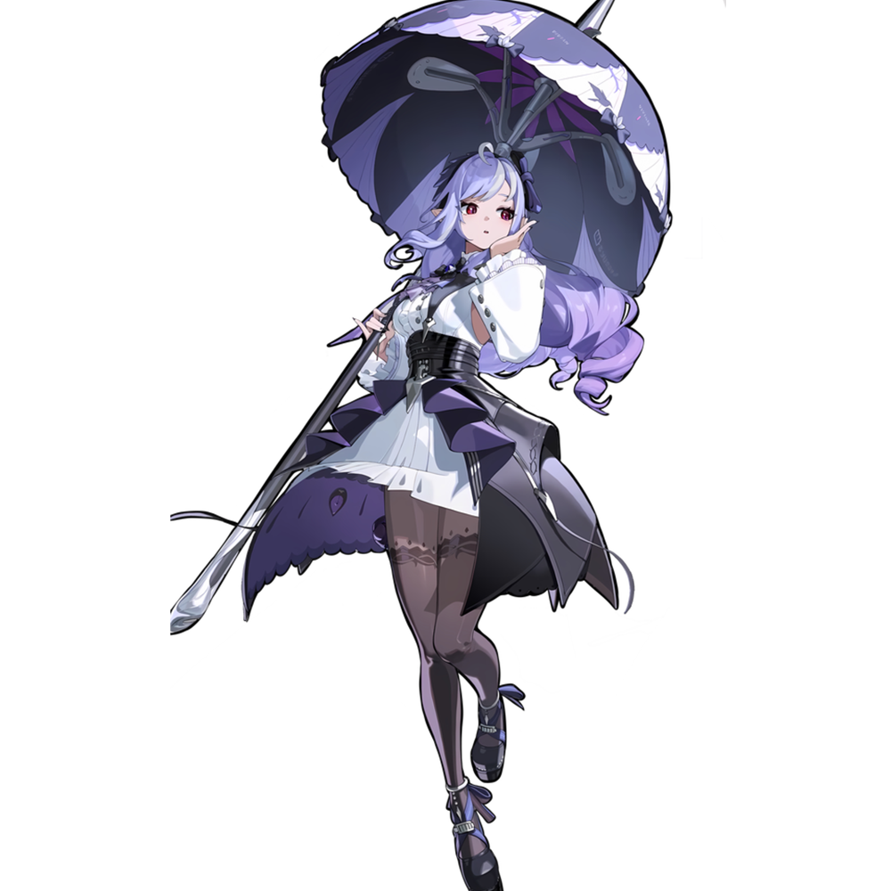

# Vivian


<div align="center">
# 简介

Vivian 是一个一个采用类液态玻璃设计风格的 VitePress 主题，基于原版默认主题魔改，使用 Mimo V2.5 Pro Vibe <br>
在此基础上，加入了一些符合我要求的设置，配色和名字均取自《绝区零》反舌鸟阵营角色薇薇安（虽然我没有薇薇安）<br>
</div>

## 依赖
 


## Demo 和文档站

[](https://tux.red)
[](https://vivian.0w0.red)

## 快速开始

```bash
# 安装依赖
pnpm install

# 启动开发服务器
pnpm dev

# 构建
pnpm build
```

## 特性

- 液态玻璃设计风格
- 深浅色模式（支持跟随系统）
- Twikoo 评论系统集成（可配置开关）
- 响应式设计
- 带点动画

## 许可证

MIT License
